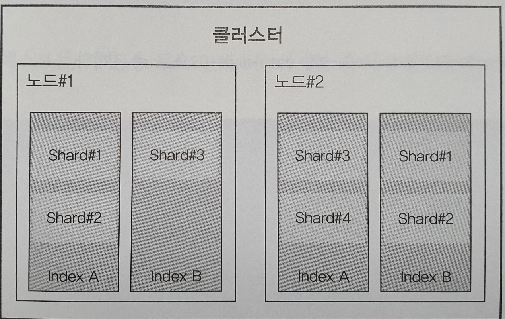

## 2.1 엘라스틱서치를 구성하는 개념

### 2.1.1 기본용어
~~~
엘라스틱서치의 구조
index -> type -> Documnet -> Field
~~~
- 인덱스
  - 인덱스는 데이터 저장공간이다.  
  하나의 인덱스는 하나의 타입만 가지며 하나의 물리적인 노드에 여러개의논리적인 인덱스를 생성할 수 있다.  
  검색 시 인덱스 이름으로 문서 데이터를 검색하며, 여러 개의 인덱스를 동시에 검색하는 것도 가능하다.  
  인덱스의 이름은 모두 소문자여야 하며 추가,수정,삭제,검색은 RESTful API로 수행가능하다.  
  만약에 인덱스가 없는상태에서 데이터가 추가된다면 데이터를 이용해 인덱스가 자동으로 생성된다.
- 샤드
  - 색인된 문서는 하나의 인덱스에 담긴다.  
  인덱스 내부에 색인된 데이터는 물리적인 공간에 여러개의 파티션으로 나뉘어 구성되는데, 이 파티션을 샤드라고 부른다.  
  엘라스틱서치는 다수의 샤드로 문서를 분산 저장하고 있어 데이터 손실 위험을 최소화할 수 있다.
- 타입
  - 타입은 인덱스의 논리적 구조를 의미하며, 인덱스 속성에 따라 분류하기도 한다.  
  장르별로 별도의 인덱스를 각각 생성해서 사용하는 것을 권장한다.
- 문서
  - 문서(Document)는 엘라스틱서치에서 데이터가 저장되는 최소 단위다.  
  json포맷으로 데이터가 저장된다. 하나의 Document는 다수의 필드로 구성돼 있는데 각 필드는 데이터의 형태에 따라 용도에 맞는  
  데이터 타입을 정의해야 한다. 또한 Document는 중첩 구조를 지원하기 떄문에 Document 안에 Document를 지정하는것도 가능하다.
- 필드
  - 문서를 구성하기위한 속성이라고 할 수 있다.  
  일반적으로 데이터베이스의 Column과 비교할수있으나, Column은 정적인 타입인 데 반해 필드는 좀더 동적인 타입이라고 할 수 있다.
- 매핑
  - 매핑은 문서의 필드와 필드의 속성을 정의하고 그에따른 색인방법을 정의하는 프로세스다.
  인덱스의 매핑정보에는 여러가지 데이터 타입을 지정할 수 있지만 필드명은 중복해서 사용할 수 없다.

### 2.1.2 노드의종류
클러스터는 물리적인 노드 인스턴스들의 모임이다.  
분산처리를 위해서는 다양한 형태의 노드들을 조합해서 클러스터를 구성해야 한다.
~~~text
설정에 따라 각 노드는 한 가지 유형으로 동작할 수도 있고 여러 개의 유형을 겸해서 동작할 수도 있다.

# 마스터 노드(Master Node)
- 클러스터를 관리한다.
- 노드 추가와 제거 같은 클러스터의 전반적인 관리를 담당한다.

# 데이터 노드(Data Node)
- 실질적인 데이터를 저장한다.
- 검색과 통계 같은 데이터 관련 작업을 수행한다.

# 코디네이팅 노드(Coordinating Node)
- 사용자의 요청만 받아서 처리한다.
- 클러스터 관련 요청은 마스터 노드에 전달하고 데이터 관련 요청은 데이터 노드에 전달한다.

# 인제스트 노드(Ingest Node)
- 문서의 전처리 작업을 담당한다.
- 인덱스 생선 전 문서의 형식을 다양하게 변경할 수 있다.
~~~

- 마스터 노드
  - 인덱스를 생성, 삭제하는 등 클러스터와 관련된 전반적인 작업을 담당한다.  
  따라서 네트워크 속도가 빠르고 지연이 없는 노드를 마스터 노드로 선정해야 한다.  
  다수의 노드를 마스터 노드로 설정할 수 있지만 결과적으로는 하나의 노드만이 마스터 노드로 선출되어 동작한다.  
  만약 노드를 마스터 노드 전용으로 설정하고자 한다면 elasticsearch.yml 파일을 열고 다음과같이 설정한다.
  ~~~
  node.master: true
  node.data: false
  node.ingest: false
  search.remote.connect: false
  ~~~
  
- 데이터 노드
  - 데이터가 실제로 분산 저장되는 물리적 공간인 샤드가 배치되는 노드이다.  
  색인 작업은 CPU, 메모리, 스토리지 같은 컴퓨팅 리소스를 많이 소모하기 때문에 리소스 모니터링이 필요하다.  
  데이터 노드는 가능한 한 마스터노드와 분리해서 구성하는게 좋으나, 색인할 문서의 수가 적으면 함께 구성해도 상관은 없다.  
  elasticsearch.yml 파일을 열고 다음과같이 설정한다.
  ~~~
  node.master: false
  node.data: true
  node.ingest: false
  search.remote.connect: false
  ~~~
  
- 코디네이팅 노드
  - 들어온 요청을 단순히 라운드로빈 방식으로 분산시켜주는 노드다.  
  elasticsearch.yml 파일을 열고 다음과같이 설정한다.
  ~~~
  node.master: false
  node.data: false
  node.ingest: false
  search.remote.connect: false
  ~~~
  
- 인제스트 노드
  - 색인에 앞서 데이터 전처리하기 위한 노드다.  
  데이터의 포맷을 변경하기 위해 스크립트로 전처리 파이프라인을 구성하고 실행할 수 있다.  
  ~~~
  node.master: false
  node.data: false
  node.ingest: true
  search.remote.connect: false
  ~~~
  
### 2.1.3 클러스터,노드,샤드

- 현재는 하나의 클러스터만 만들어져 있지만 여러 개의 클러스터를 연결해서 구성할 수도 있으며, 이때는 클러스터의 이름으로 각각을 구분한다.  
  만약 클러스터의 이름이 명시적으로 설정되지 않았다면 엘라스틱서치가 크러스터의 이름을 임의의 문자열로 지정한다.  
  또한 클러스터에 있는 노드는 실시간으로 추가, 제거가 가능하기 때문에 가용성이나 확장성 측면에서 매우 유연하다.
- 클러스터에 3개의 노드로 구성했다고 가정했을시
~~~
- 프라이머리 샤드 3, 레플리카 샤드 0세트 구성  
  - 일반적으로 프라이머리 샤드는 안정성을 위해 3개의 노드에 하나씩 분산 저장된다.
- 프라이머리 샤드 6, 레플리카 샤드 0세트 구성
  - 노드당 프라이머리 샤드 6개가 2개씩 배치된다. 앞선 구성보다 프라이머리 샤드의 수가 2배 많기때문에 데이터가 더 잘게 쪼개져서 저장된다.
- 프라이머리 샤드 3, 레플리카 샤드 1세트 구성
  - 엘라스틱서치는 장애 시 레플리카 샤드를 이용해 샤드를 복구한다. 따라서 노드당 프라이머리 샤드1개 레플리카 샤드가 1개씩 배치된다.
~~~

## 2.2 엘라스틱서치에서 제공하는 주요 API
- API의 종류
~~~
- 인덱스 관리 API(Indices API): 인덱스관리
- 문서 관리 API(Document API): 문서의 추가/수정/삭제
- 검색 API(Search API): 문서 조회
- 집계 API(Aggregation API): 문서 통계
~~~
문서를 색인하기 위해서는 기본적으로 인덱스라는 그릇을 생성해야 한다.  
인덱스를 통해 입력되는 문서의 필드를 정의하고 각 필드에 알맞은 데이터 타입을 지정할 수 있다.  
이러한 과정을 통해 더 효율적인 색인이 가능해진다.
- 용어구분
~~~
- Index: 색인데이터
- Indexing: 색인하는 과정
- Indices: 매핑 정보를 저장하는 논리적인 데이터 공간
~~~
- 스키마리스 기능은 가급적이면 사용하지 말자
엘라스틱 서치는 사용편의성을 위해 스키마리스(Schemaless)라는 기능을 제공한다.  
인덱스 생성 과정없이 문서를 추가하더라도 문서가 색인되도록 지원하는 일종의 편의기능이다.  
이를 이용하면 다양한 형태의 비정형 데이터를 하나의 인덱스로 구성할 수 있다. 하지만 성능과 밀접한 연관이 있기때문에 특수한 상황에서만 사용해야 한다.  
인덱스가 자동으로 생성할 경우 세부적인 필드정보가 매핑되지 않아 특정 단어를 검색할 때 검색 결과에서 누락되는 등 문제가 발생할 가능성이 높아진다.
~~~
원문
"아버지가 방에 들어 가신다"
~~~
___
원문을 스키마리스를 이용해 색인한다면 기본적으로 text 타입의 Standard Analyzer를 사용하는 데이터 타입이 정의 될 것이다.  
이러한 경우 해당 분석기는 "아버지가", "방에", "들어", "가신다" 라는 토큰으로 분리되어 텀(Term)이 생성되고  
검색 시 "아버지"라는 키워드가 입력되더라도 해당 문서는 검색되지 않을 것이다. 검색을 위해서는 분리한 토큰 그대로 "아버지가"라는 키워드를 입력해야한다.  
원하는 결과를 얻기위해서는 한글 형태소를 분석하는 분석기를 사용하도록 데이터 타입을 직접 정의해야 한다.  
스키마리스 방식의 사용을 지양하고 반드시 인덱스를 직접 정의해서 사용하는 습관을 들이는 것이 좋다.
---
실수로 인덱스를 설정하지 않고 데이터를 색인하면 엘라스틱서치는 인덱스를 자동 생성하게되고, 이는 시스템의 안정성을 해치게 된다.  
실수를 방지하기 위해 스키마리스 기능을 명시적으로 사용하지 않도록 설정하는 것이 가능하다.  
노드 설정 파일에서 action.auto_create_index=flase로 설정 -> 자동 인덱스 생성 비활성화  
index.mapper.dynamic=false로 설정 -> 특정 컬럼의 자동매핑 생성 비활성화
---

### 2.2.1 인덱스 관리 API
- 인덱스 생성
  - 인덱스를 생성할 때는 매핑이라는 세부 설정을 이용할 수 있는데 매핑은 무서와 문서에 포함된 필드, 필드 타입 등을 세세하게 지정하는 것이 가능  
  주의할 점은 한번 생성된 매핑 정보는 변경할수 없기 때문에 잘못 생성하거나 수정 해야 하는 경우 데이터를 삭제하고 다시 색인하는 수밖에 없다.  
  엘라스틱서치는 다양한 형태의 데이터 타입을 제공한다.  
  keword 타입 : 단순 문자열
  text 타입 : 형태소 분석
- 인덱스 삭제

### 2.2.2 문서 관리 API
색인된 문서의 ID를 기준으로 한 건의 문서를 다뤄야 하는 경우 문서관리 API를 사용한다.
~~~
Single-document API
- Index API: 한 건의 문서를 색인한다.
- Get API: 한 건의 문서를 조회한다.
- Delete API: 한 건의 문서를 삭제한다.
- Update API: 한 건의 무서를 업데이트한다.
~~~
다수의 문서를 처리해야 하는 경우
~~~
- Multi Get API: 다수의 문서를 조회한다.
- Bulk API: 대량의 문서를 색인한다.
- Delete By Query API: 다수의 문서를 삭제한다
- Update  By Query API: 다수의 문서를 업데이트한다.
- Reindex API: 인덱스의 문서를 다시 색인한다.
~~~

- 문서 생성
- 문서 조회
- 문서 삭제
- Id를 지정하지 않고 문서를 생성
  - id값을 지정하지않으면 UUID를 통해 무작위로 생성된다.  
  이러한 방식이 자칫 편리해 보일 수도 있지만, 무작위 생성된 Id 값 때문에 해당 문서를 업데이트 할 때 애로 사항이 생긴다.
  그래서 색인된 문서의 _id 값은 업데이트를 고려해서 데이터베이스 테이블의 식별 값과 맞춰 주는 것이 중요하다.

### 2.2.3 검색 API
엘라스틱서치의 검색 API의 사용 방식은 크게 두가지로 나뉜다.
~~~
1. HTTP URI 형태의 파라미터를 URI에 추가해 검색하는 방법
2. RESTful API 방식인 QueryDSL을 사용해 요청 본문(Request Body)에 질의 내용을 추가해 검색하는 방법
~~~
Request Body 방식은 URI 방식보다 제약사항이 적기 때문에 현업에서는 Request Body 방식을 선호한다.  
URI 방식은 간단한 쿼리검색이나 디버깅등 간편하게 사용하는 경우 종종 사용된다.  
조건을 여러 개 만들거나, 통계를 위한 집계(Aggregation) 쿼리 등 복잡한 쿼리를 작성하려면 QueryDSL 을 사용하는 것이 좋다.  
URI로 여러단계의 구조를 가지는 중첩된 형태 표현하는 것은 불가능하기 때문.

- URI 방식의검색 질의
  JSON 포맷 헤더에는 쿼리가 실행된 총 시간(time_out)과 결과를 보여준다.  
  _shards에서는 성공적으로 반환한 샤드의 수와 실패한 샤드의 수를 알 수 있다.  
  hits에서는 일치하는 문서의 수와 함꼐 점수(_score)가 가장 높은 상위10개의 문서를 보여준다.
- Request Body 방식의 검색 질의
  URI 검색 질의는 여러 필드를 각기 다른 검색어로 질의하는 것이 어렵다. 쿼리조건이 복잡하고 길어지기 때문이다.  
  JSON 포맷을 이용해 RESTful 방식으로 질의하면 매우 복잡한 쿼리도 쉽게 표현할 수 있고 여러 조건을 한 번에 처리할 수 있다.
~~~
- 사용법
POST /{index명}/_search
{
JSON 쿼리 구문
}
~~~

- 쿼리 구문은 다음과 같이 여러 개의 키를 조합해 객체의 키 값으로 사용할 수 있다.
~~~
{
  size: # 몇 개의 결과를 반환할지 결정한다 (기본값은 10)
  
  from: # 어느 위치부터 반환한지를 결정하낟.
        # 0부터 시작하면 상위 0~10건의 데이터를 반환한다 (기본값은 0)
        
  _source: #특정 필드만 결과로 반환하고 싶을 때 사용한다.
  
  sort: # 특정 필드를 기준으로 정렬한다.
        # asc,desc로 오름차순, 내림차순 정렬을 지정할 수도 있다.
        
  query: {
    # 검색될 조건을 정의한다.
  }
  
  filter: {
    # 검색 결과 중 특정한 값을 다시 보여준다.
    # 결과 내에서 재검색할 때 사용하는 기능 중 하나다.
    # 다만 필터를 사용하게 되면 자동으로 score 값이 정렬되지 않는다.
  }
}
~~~

### 2.2.4 집계 API
엘라스틱서치에서는 패싯(Facets) 방식의 통계 기능을 제거하고 독자적인 집계(Aggregation) API를 이용한다.  
집계 API는 기본적으로 메모리 기반으로 동작하기 때문에 대용량의 데이터 통계 작업이 가능해졌다.  
쿼리에 사용되는 집계에 따라 수치를 계산하고 동적으로 카운팅하거나 히스토그램 같은 작업 등도 할수 있다.  
엘라스틱서치의 집계 API는 각종 통계 데이터를 실시간으로 제공할 수 있는 강력한 기능이다.

- 데이터 집계  
  집계 결과를 살펴보면 버킷(Buckets)이라는 구조안에 그룹화된 데이터가 포함돼 있다.  
  엘라스틱서치의 집계가 강력한 이유 중 하나는 버킷 안에 다른 버킷결과를 추가할 수 있다는 점이다.  
  이러한 특성을 이용해 다양한 집계 유형을 결합하거나 중첩, 조합하는것이 가능해진다.

-데이터 집계 타입  
집계 기능은 현재 4가지 API로 제공된다. 집계기능은 서로 조합해 사용할 수 있다.
~~~
1. 버킷 집계(Bucket Aggregation)
 - 집계 중 가장 많이 사용한다. 문서의 필드를 기준으로 버킷을 집계한다.
2. 메트릭 집계(Metric Aggregation)
 - 문서에서 추출된 값을 가지고 Sum, Max, Min, Avg를 계산한다.
3. 매트릭스 집계(Matrix Aggregation)
 - 행렬의 값을 합하거나 곱한다.
4. 파이프라인 집계(Pipeline Aggregation)
 - 버킷에 도출된 결과 문서를 다른 필드 값으로 재분류한다. 즉, 다른집계에 의해 생성된 출력 결과를 다시 한번 집계한다.
   집계가 패싯보다 강력한 이유이다.
~~~