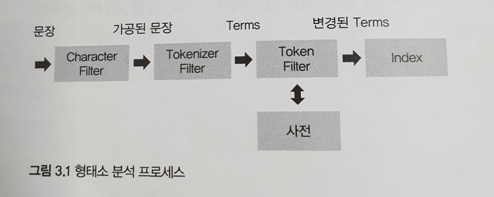
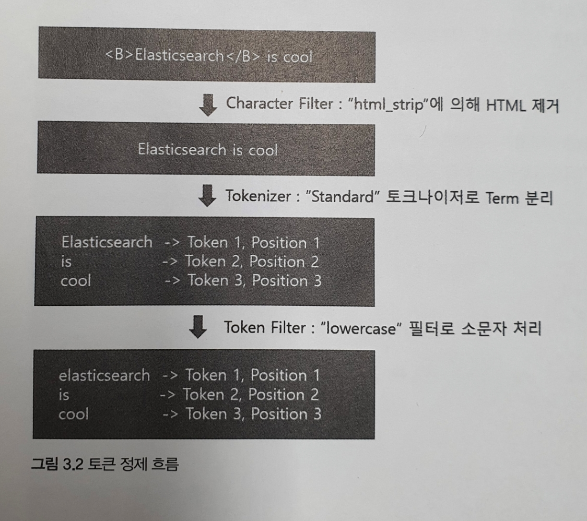

## 3.1 매핑 API 이해하기
매핑은 색인 시 데이터가 어디에 어떻게 저장될지를 결정하는 설정이다.  
인덱스에 추가되는 각 데이터 타입을 구체적으로 정의하는 일이다.
엘라스틱서치는 기본적으로 스키마리스이기 때문에 명시적으로 필드를 정의하지 않아도 데이터 유형에 따라 필드 데이터 타입에 대한 매핑 정보가 자동으로 생성된다.  
하지만 잘못 생성된 매핑의 타입은 변경할수 없기 때문에 탑입을 변경하려면 인덱스를 삭제한 후 다시 생성하거나 매핑을 다시 정의해야한다.  
매핑 정보를 설정할 때는 다음과 같은 사항을 고민해야 한다.
~~~
- 문자열을 분석할 것인가?
- _source에 어떤 필드를 정의할 것인가?
- 날짜필드를 가지는 필드는 무엇인가?
- 매핑에 정의되지 않고 유입되는 필드는 어떻게 처리할 것인가?
~~~
실무에서는 다양한 이유로 동적 매핑을 거의 사용하지 않는다.  
따라서 인덱스를 생성할 때 항상 명시적인 매핑 설정을 사용한다.

### 3.1.1 매핑 인덱스 만들기
인덱스명은 movie_search  

|   매핑명    |         필드명         |       필드 타입       |
|:--------:|:-------------------:|:-----------------:|
|   인덱스키   |       moiveCd       |      keyword      |
| 영화제목_국문  |       movieNm       |       text        |
| 영화제목_영문  |      movieNmEn      |       text        |
|   제작연도   |      prdtYear       |      integer      |
|   개봉연도   |       openDt        |      integer      |
|   영화유형   |       typeNm        |      keyword      |
|   제작상태   |     prdtStatNm      |      keyword      |
| 제작국가(전체) |      nationAlt      |      keyword      |
|  장르(전체)  |      genreAlt       |      keyword      |
| 대표 제작국가  |     repNationNm     |      keyword      |
|   재표장르   |     repGenreNm      |      keyword      |
|  영화감독명   | directors.peopleNm  | object -> keyword |
|  제작사코드   | companies.companyCd | object -> keyword |
|   제작사명   | companies.companyNm | object -> keyword |
~~~
PUT movie_search
{
  "settings": {
    "number_of_shards": 5,
    "number_of_replicas": 1
  },
  "mappings": {
    "properties": {
      "moiveCd":{
        "type": "keyword"
      },
      "movieNm":{
        "type": "text"
      },
      "moiveNmEn":{
        "type": "text"
      },
      "prdtYear":{
        "type": "integer"
      },
      "openDt":{
        "type": "integer"
      },
      "typeNm":{
        "type": "keyword"
      },
      "prdtStatNm":{
        "type": "keyword"
      },
      "nationAlt":{
        "type": "keyword"
      },
      "genreAlt":{
        "type": "keyword"
      },
      "repNationNm":{
        "type": "keyword"
      },
      "repGenreNm":{
        "type": "keyword"
      },
      "directors": {
        "properties": {
          "peopleNm": {
            "type": "keyword"
          }
        }
      },
      "companies": {
        "properties": {
          "companyCd": {
            "type": "keyword"
          },
          "companyNm": {
            "type": "keyword"
          }
        }
      }
    }
  }
}
~~~

### 3.1.2 매핑 확인
이미 만들어진 매핑을 확인하려면 엘라스틱서치에서 제공하는 _mapping API를 사용할 수 있다. 앞에서 만든 movie_search 인덱스의 매핑정보를 확인한다.
> GET movie_search/_mapping

### 3.1.3 매핑 파라미터
- analyzer  
해당 필드의 데이터를 형태소 분석하겠다는 의미의 파라미터다. 색인과 검색 시 지정한 분석기로 형태소 분석을 수행한다.  
text 타입의 필드는 analyzer 매핑 파라미터를 기본적으로 사용해야 하며, 별도 지정을 안할 시 Standard Analzer로 형태소 분석을 수행한다.
- normalizer  
term query에 분석기를 사용하기 위해 사용된다.  
예를들어 keyword 데이터 타입의 경우 원문을 기준으로 문서가 색인되기 때문에 cafe,Cafe,Café는 서로 다른 문서로 인식된다.  
하지만 해당 유형을 normalizer를 통해 분석기에 asciifolding과 같은 필터를 사용하면 같은 데이터로 인식되게 할 수 있다.
- coerce  
색인 시 자동 변환을 허용할지 여부를 설정하는 파라미터다.  
예를 들어 "10" 과같은 integer타입이 필드에 들어온다면 엘리스틱서치가 자동으로 형변환을 수행해서 정상적으로 처리한다.  
하지만 coerce 설정을 미상용으로 변경한다면 색인에 실패한다.
- copy_to  
매핑 파라미터를 추가한 필드의 값을 지정한 필드로 복사한다. 또한 여러개의 필드 데이터를 하나의 필드에 모아서 전체검색 용도로 사용한다.
~~~
{
  "moiveCd": "20173732",
  "movieNm":"살아남은 아이",
  "movieNmEn":"Last Child",
}
~~~
위와 같이 색인된 문서에서 copy_to 파라미터를 이용하면 movieNm과 movieNmEn의 결과를 합해서 "살아남은 아이 Last Child" 라는 데이터를 저장하는 필드를 생성 할 수 있다. 
- fielddata  
엘라스틱서치가 힙 공간에 생성하는 메모리 캐시다. 최신버전 엘라스틱캐시는 doc_values라는 새로운 형태의 캐시를 사용한다.  
부득이하게 text 타입의 필드에서 집계나 정렬을 수행하는 경우 fielddata를 사용할 수 있다. 하지만 메모리에 생성되는 캐시이기 때문에 최소한으로만 사용 해야 한다.  
fielddata는 메모리 소모가 크기 때문에 기본적으로 비활성화 돼 있다. 사용법은 다음과 같다.
~~~
PUT movie_search_mapping/_mapping/_doc
{
  "properties": {
    "nationAlt":{
        "type": "text",
        "fielddata": true
      }
  }
}
~~~
- doc_values  
엘라스틱서치에서 사용하는 기본캐시다.  
text 타입을 제외한 모든 타입에서 기본적으로 doc_values 캐시를 사용한다. 과거에는 캐시를 모두 메모리에 올려 사용했으나 현재는 힙 사용에 대한 부담을 없애고,  
운영체제의 파일 시스템 캐시를 통해 디스크에 있는 데이터에 빠르게 접근할 수 있다. 이로인해 GC의 비용이 거의 들지 않으며 메모리 연산과 비슷한 성능을 보여준다.  
필드를 정렬,집계할 필요가 없고 스크립트에서 필드 값에 엑세스할 필요가 없다면 디스크 공간 절약을 위해 doc_values를 비활성화할 수도 있다.  
한번 비활성화된 필드는 인덱스를 재색인하지 않는 한 변경이 불가능하다.
- dynamic  
매핑에 필드를 추가하 때 동적으로 생성할지를 결정한다. 동적 생성 필드의 처리 방법은 세 가지 설정중 하나를 지정할 수 있다.
~~~
1. true - 새로 추가되는 필드를 매핑에 추가한다.
2. false - 새로 추가되는 필드를 무시한다. 해당 필드는 색인되지 않아 검색할 수 없지만 _source에는 표시된다.
3. strict - 새로운 필드가 감지되면 예외가 발생하고 문서 자체가 색인되지 않는다. 새로 유입되는 필드는 사용자가 매핑에 명시적으로 추가해야 한다.
~~~
- enabled  
검색 결과에는 포함하지만 색인은 하고 싶지 않은 경우도 있다. 메타 성격의 데이터가 그렇다. 예를들어 일반적인 게시판이라면 제목과 요약글만 색인하고 날짜와 사용자 ID는 색인하지 않는 경우다.  
색인을 원하지 않는 날짜와 사용자 ID의 매핑 파라미터 중 enabled를 false로 설정하면 _source에는 검색되지만 색인은 하지 않는다.
- format  
엘라스틱서치는 날짜/시간을 문자열로 표시한다. 이떄 날짜/시간을 문자열로 변경할 때 미리 구성한 포맷을 사용할 수 있다.  

|                                    포맷                                     |            날짜 형식            |          비고           |
|:-------------------------------------------------------------------------:|:---------------------------:|:---------------------:|
|                                basic_date                                 |          yyyyMMdd           |        년도/월/일         |
|                              basic_date_time                              |    yyyMMdd'T'HHmmss.SSSZ    | 년도/월/일/T/시/분/초/밀리초/Z  |
|                                basic_time                                 |         HHmmss.SSS          |      시/분/초/밀리초/Z      |
|                             date/strict_date                              |         yyyy-MM-dd          |        년도/월/일         |
|        date_hour_minute_second/ strict_date_hour_minute_second        |   yyyy-MM-dd'T'HH:mm:ss.    |    년도/월/일/T/시/분/초     |
| date_hour_minute_second_millis/ strict_date_hour_minute_second_millis | yyyy-MM-dd'T'HH:mm:ss.SSS.  |  년도/월/일/T/시/분/초/밀리초   |
|                        date_time/strict_date_time                         | yyyy-MM-dd'T'HH:mm:ss.SSSZZ | 년도/월/일/T/시/분/초/밀리초/ZZ |

- ignore_above  
필드에 저장되는 문자열이 지정한 크기를 넘어서면 빈 값으로 색인한다. 지정한 값이 아니라 빈 값으로 저장되므로 주의한다.
- ignore_malformed  
엘라스틱서치에서는 잘못된 데이터 타입을 색인하려고 하면 예외가 발생하고 해당 문서 전체가 색인되지 않는다.  
이 매핑파라미터를 사용하면 해당필드만 무시하고 문서는 색인할 수 있다.
- index  
필드값을 색인할지를 결정한다. 기본값은 true이며, false로 변경하면 해당 필드를 색인하지 않는다.
- fields  
다중 필드(multifield)를 설정할 수 있는 옵션이다. 필드 안에 또 다른 필드의 정보를 추가할 수 있어 같은 string값을 각각 다른분석기로 처리하도록 설정할 수 있다.  
다음과 같이 기본 필드는 전문 검색을 하고 필드 안의 추가 필드는 집계용으로 사용할 수 있다.
~~~
PUT movie_search_mapping
{
  "mappings": {
    "properties": {
      "awards":{
        "type": "text",
        "fields": {
          "name": {
            "type" : "keyword"
          }
        }
      }
    }
  }
}
~~~
- norms  
문서의 _score 값 계산에 필요한 정규화 인수를 사용할지 여부를 설정한다. 기본값은 true.  
_score 계산이 필요없거나 단순 필터링 용도로 사용하는 필드는 비활성화해서 디스크 공간을 절약할 수 있다.
- null_value  
엘라스틱서치는 색인 시 문서에 필드가 없거나 필드의 값이 null이면 색인 시 필드를 생성하지 않는다.  
이 경우 null_value를 설정하면 문서의 값이 null이더라도 필드를 생성하고 그에 해당하는 값으로 저장한다.
~~~
PUT movie_search_mapping/_mapping
{
  "properties": {
    "audiCnt": {
      "type": "integer",
      "null_value": "0"
    }
  }
}
~~~
- position_increment_gap  
배열(Array) 형태의 데이터를 색인할 때 검색의 정확도를 높이기 위해 제공하는 옵션이다.  
필드 데이터 중 단어와 단어 사이의 간격(slop)을 허용할지를 설정한다. 검색 시 단어와 단어 사이의 간격을 기준으로 일치하는 문서를 찾는 데 필요하다.  
예를 들어, 데이터가 ["Jhon Abraham", "Lincon Smith"]일 때 "Abraham Lincon"으로 검색하더라도 검색이 가능하다.
- properties  
오브젝트(Object) 타입이나 중첩(Nested) 타입의 스키마를 정의할 때 사용되는 옵션으로 필드의 타입을 매핑한다.  
오브젝트 필드 및 중첩필드에는 properties라는 서브 필드가 있다. 이 properties는 object나 nested를 포함한 모든 데이터 타입이 될 수 있다.
- search_analyzer  
일반적으로는 색인과 검색 시 같은 분석기를 사용한다. 만약 다른 분석기를 사용하고 싶은 경우 search_analyzer를 설정해서 검색 시 사용할 분석기를 별도로 지정할 수 있다.  
- similarity  
유사도 측정 알고리즘을 지정한다. 유사도 측정 방식을 기본 알고리즘인 BM25에서 다른 알고리즘으로 변경할 수 있다.

|  알고리즘   |                                                             설명                                                             | 
|:-------:|:--------------------------------------------------------------------------------------------------------------------------:|
|  BM25   |                                        Okapi BM25 알고리즘이다. 엘라스틱서치의 기본 유사도 측정 알고리즘이다.                                        |
| classic |                                   TF/IDF 알고리즘이다. 문서 내 용어의 개수와 전체 용어의 개수를 이용해 유사도를 계산한다.                                    |
| boolean | 복잡한 수학적 모델을 사용하지 않고 단순히 boolean 연산으로 유사도를 측정한다. score는 검색어 일치 여부에 따라결정되며, 검색 결과의 일치여부에 따라 쿼리의 가중치에 사용된 점수로만 유사도를 계산한다. |

- store  
필드의 값을 저장해 검색 결과에 값을 포함하기 위한 매핑 파라미터다.  
기본적으로 _source에 색인된 문서가 저장된다. 하지만 store 매핑 파라미터를 사용하면 해당 필드를 자체적으로 저장할 수 있다.  
예를 들어 10개의 필드가 존재하고 해당 필드에 데이터를 매핑한 상태라면 _source를 로드해서 해당 필드를 찾는 것보다 사용할 각 필드만 로드해서 사용하는 편이 효율적이다.  
하지만 해당 매핑 파라미터를 사용하면 디스크를 더 많이 사용한다.
- term_vector  
루씬에서 분석된 용어의 정보를 포함할지 여부를 결정하는 매핑 파라미터다. 설정 가능한 인자는 다음과 같다.

|           인자            |                 설명                 | 
|:-----------------------:|:----------------------------------:|
|           no            |           텀벡터를 저장하지 않는다.           |
|           yes           |           필드와 용어만 저장한다.            |
|     with_positions      |      용어, 용어의 시작과 끝 위치를 저정한다.       |
|      with_offsets       |         용어, 문자 오프셋을 저정한다.          |
| with_positions_offsets  | 용어, 용어의 시작과 끝 위치, 문자 오프셋을 모두 저장한다. |

## 3.2 메타필드
메타 필드(Meta Fields)는 엘라스틱서치에서 생성한 문서에서 제공하는 특별한 필드다.  
메타데이터를 저장하는 특수 목적의 필드로서 이것을 이용하면 검색 시 문서를 다양한 형태로 제어하는것이 가능하다.

### 3.2.1 _index 메타 필드
- 해당 문서가 속한 인덱스의 이름을 담고있다. 검색된 문서의 인덱스명을 알 수 있으며, 해당 인덱스에 몇 개의 문서가 있는지 확인할 수 있다.
### 3.2.2 _type 메타 필드
- 해당 문서가 속한 매핑의 타입 정보를 담고 있다. 인덱스 내부에서 타입별로 몇 개의 문서가 있는지 확인할 수 있다.
### 3.2.3 _id 메타 필드
- 문서를 식별하는 유일한 키 값이다. 한 인덱스에서 색인된 문서마다 서로 다른 키 값을 가진다.
### 3.2.4 _uid 메타 필드
- 특수한 목적의 식별키다. "#" 태그를 사용해 _type과 _id 값을 조합해 사용한다. 하지만 내부적으로만 사용되기 때문에 검색 시 조회되는 값은 아니다.
### 3.2.5 _source 메타 필드
- 문서의 원본 데이터를 제공한다. 내부에는 색인 시 전달된 원본 JSON 문서의 본문이 저장돼 있다. 일반적으로 JSON 문서를 검색결과로 표시할 때 사용한다.  
_reindex API나 스크립트를 사용해 해당 값을 계산할 때 해당 메타 필드를 활용할 수 있다.
### 3.2.6 _all 메타 필드
- 색인에 사용된 모든 필드의 정보를 가진 메타 필드다. 모든 필드의 내용이 하나의 텍스트로 합쳐져서 제공된다.  
특정 필드가 아닌 문서 전체 필드에서 특정키워드를 검색한다면 _all 메타 필드를 사용하면 된다. _all 메타 필드에는 예를들어 필드값이 4개라면 값이 모두 합쳐저서 하나의 문자열  
  ("20173732 살아남은 아이 Last Child 2017") 이 생성되어 저장된다. 이를 이용하면 통합 검색을 구현할 때 유리할 수 있다.  
하지만 데이터 크기를 너무 많이차지하는 문제로 엘라스틱서치 6.0부터는 dprecated 되었고, 필드 복사가 필요할 경우 copy_to 파라미터를 사용하면 _all과 동일한 효과를 낼 수 있다.
### 3.2.7 _routing 메타 필드
- 특정 문서를 특정 샤드에 저장하기 위해 사용자가 지정하는 메타 필드다. 기본적으로 색인을 하면 해당 문서는 다음수식에 따라 문서 id를 이용해 문서가 색인될 샤드를 결정한다.  
별도의 설정 없이 문서를 색인하면 문서는 샤드에 골고루 분산되어 저장된다.  
어떤 경우에는 특정 문서들을 하나의 샤드에 저장하고 싶을 수 있다. 이때 _routing 메타 필드를 사용하면 색인할 때 해당 문서들은 동일한 라우팅 ID를 지정한다.  
문서 ID를 사용하는 대신 파라미터로 입력한 _routing 값이 샤드를 결정하는 데 사용된다. 예를들면
~~~
PUT movie_routing/_doc/1?routing=ko
{
"repGenreNm": "한국어",
"movieNm": "살아남은 아이"
}
~~~
_routing 값을 ko 로 지정해 문서를 색인 한뒤 조회한다.

> GET movie_routing/_search?routing=ko
~~~
"hits" : [
      {
        "_index" : "movie_routing",
        "_id" : "1",
        "_score" : 1.0,
        "_routing" : "ko",
        "_source" : {
          "repGenreNm" : "한국어",
          "movieNm" : "살아남은 아이"
        }
      }
    ]
~~~
검색 결과를 살펴보면 _routing의 값이 ko로 지정된 것을 확인할 수 있다.

## 3.3 필드 데이터 타입
필드에는 다음과같은 데이터 타입을 지정할 수 있다.
~~~
- keyword, text 같은 문자열 데이터 타입
- date, long, double, integer, boolean, ip 같은 일반적인 데이터 타입
- 객체 또는 중첩문과 같은 JSON 계층의 특성의 데이터 타입
- geo_point, geo_shape 같은 툭수한 데이터타입
~~~
### 3.3.1 Keyword 데이터 타입
별도의 분석기를 거치지 않고 원문 그대로 색인하기 때문에 특정 코드나 키워드 등 정형화된 콘텐츠에 주로 사용된다.  
엘라스틱서치 일부 기능은 형태소 분석을 하지 않아야만 사용이 가능한데 이 경우에도 Keyword 데이터 타입이 사용된다.
Keyword 데이터 타입은 아래에 해당하는 항목에 많이 사용된다.
- 검색 시 필터링되는 항목
- 정렬이 필요한 항목
- 집계(Aggregation)해야 하는 항목

이 세가지 경우에는 반드시 Keyword 타입을 사용해야 한다. 만약 'elastic search'라는 문자열을 Keyword 타입으로 설정하면 'elastic'이나 'search'라는 질의로는 절대 검색되지 않는다.  
'elastic search'라고 질의해야만 검색된다.
Keyword 타입에서 설정가능한 주요 파라미터는 아래와 같다.  

|     -      |                                                                            -                                                                            |
|:----------:|:-------------------------------------------------------------------------------------------------------------------------------------------------------:|
|   boost    | 필드의 가중치로, 검색 결과 정렬에 영향을 준다. 기본값은 1.0으로서 1보다크면 Score가 높게 오르고, 저긍면 점수가 낮게오른다. 이를 이용해 검색에 사용된 키워드와 문서 간의 유사도 스코어 값을 계산할 때 필드의 가중치 값을 얼마나 더 줄것인지를 판단한다. | 
| doc_values |                                                            필드를 메모리에 로드해 캐시로 사용한다. 기본값은 true                                                             |
|   index    |                                                            해당 필드를 검색에 사용할지를 설정한다. 기본값은 true                                                             |
| null_value |                                     기본적으로 엘라스틱서치는 데이터의 값이 없으면 필드를 생성하지 않는다. 데이터의 값이 없는 경우 null로 필드의 값을 대체할지를 설정한다.                                      |
|   store    |                                                필드 값을 필드와 별도로 _source에 저장하고 검색 가능하게 할지를 설정한다. 기본값은 false                                                 |

### 3.3.2 Text 데이터 타입
색인 시 지정된 분석기가 칼럼의 데이터를 문자열 데이터로 인식하고 이를 분석한다.  
만약 별도의 분석기를 정의하지 않았다면 기본적으로 Standard Analyzer를 사용한다.  
영화의 제목이나 영화의 설명글과 같이 문장 형태의 데이터에 사용하기 적합한 데이터 타입이다.  
Text 데이터 타입은 전문 검색이 가능하다는게 큰 특징이다. Text 타입으로 데이터를 색인하면 전체 텍스트가 토큰화되어 생성되며 특정 단어를 검색하는 것이 가능해진다.  
Text 데이터 타입을 사용할 경우 필드에 검색뿐 아니라 정렬이나 집계 연산을 사용해야 할 때가 있다. 이러한 경우 Text 타입과 Keyword 타입을 동시에 갖도록 멀티 필드로 설정할 수 있다.  
예를들면 이렇다.
~~~
PUT movie_search/_mapping/_doc
{
  "movieComment":{
    "type": "text",
    "fields": {
      "movieComment_keyword": {
        "type": "keyword"
      }
    }
  }
}
~~~

Text 타입에서 설정 가능한 주요 파라미터는 아래와 같다.

|        -        |                                     -                                     |
|:---------------:|:-------------------------------------------------------------------------:|
|    analyzer     |            인덱스와 검색에 사용할 형태소 분석기를 선택한다. 기본값은 Standard Analyzer             |
|      boost      | 필드의 가중치로, 검색 결과 정렬에 영향을 준다. 기본값은 1.0으로 1보다 크면 점수가 높게 오르고, 적으면 점수가 낮게 오른다. |
|    fielddata    |         정렬, 집계, 스크립트 등에서 메모리에 저장된 필드 데이터를 사용할지를 설정한다. 기본값은 false          |
|      index      |                     해당 필드를 검색에 사용할지를 설정한다. 기본값은 true                      |
|      norms      |                     유사도 점수를 산정할 때 필드 길이를 고려할지를 결정한다.                      |
|      store      |         필드 값을 필드와 별도로 _source에 저장하고 검색 가능하게 할지를 설정한다. 기본값은 false          |
| search_analyzer |                          검색에 사용할 형태소 분석기를 선택한다.                           |
|   similarity    |                     유사도 점수를 구하는 알고리즘을 선택한다. 기본값은 BM25                     |
|   term_vector   |                   Analyzed 필드에 텀벡터를 저장할지를 결정한다. 기본값은 no                   |

### 3.3.3 Array 데이터 타입
데이터는 대부분 1차원으로 표현되지만 2차원으로 존재하는 경우도 있을 것이다.  
Array 타입은 문자열이나 숫자처럼 일반적인 값을 지정할 수도 있지만 객체형태로도 정의할 수 있다.  
한 가지 주의할 점은 Array 타입에 저장되는 값은 모두 같은 타입으로만 구성해야 한다는 점이다.
- 문자열 배열: ["one", "two"]
- 정수 배열: [1, 2]
- 객체 배열: [ { "name": "Mary", "age": 12}, {"name": "Jhon", "age": 10 } ]  

엘라스틱서치에서는 매핑 설정 시 Array 타입을 명시적으로 정의하지 않는다. 모든 필드가 기본적으로 다수의 값을 가질 수 있기 때문이다.  
정의된 인덱스 필드에 단순히 배열 값을 입력하면 자동으로 Array 형태로 저장된다. 만약 필드가 동적으로 추가된다면 배열의 첫 번째 값이 필드의 데이터 타입을 결정하며,  
이후의 데이터는 모두 같은 타입이어야 색인할 때 오류가 발생하지 않는다.

### 3.3.4 Numeric 데이터 타입
엘라스틱서치에서는 숫자 데이터 타입이 여러 가지 종류로 제공된다. 그 이유는 데이터 크기에 알맞은 타입을 제공함으로써 색인과 검색을 효율적으로 처리하기 위해서다.

|     -      |                          -                           |
|:----------:|:----------------------------------------------------:|
|    long    | 최솟값과 최댓값을 가지는 부호 있는 64비트 정수. 범위는 [-2^63 ~ 2^63 - 1]  |
|  integer   | 최솟값과 최댓값을 가지는 부호 있는 32비트 정수. 범위는 [-2^31 ~ 2^631 - 1] |
|   short    | 최솟값과 최댓값을 가지는 부호 있는 16비트 정수. 범위는 [-32,768 ~ 32,767]  |
|    byte    |     최솟값과 최댓값을 가지는 부호 있는 8비트 정수. 범위는 [-128 ~ 127]     |
|   double   |                  64비트 부동 소수점을 갖는 수                   |
|   float    |                  32비트 부동 소수점을 갖는 수                   |
| half_float |                  16비트 부동 소수점을 갖는 수                   |

### 3.3.5 Date 데이터 타입
Date 타입은 JSON 포맷에서 분자열로 처리된다. 날짜는 다양하게 표현될 수 있기 때문에 올바르게 구문 분석될 수 있게 날짜 문자열 형식을 명시적으로 설정해야 한다.  
만약 별도의 형식을 지정하지 않을 경우 기본형식인 "yyyy-MM-ddTHH:mm:ssZ"로 지정된다.  
Date 타입은 다음과 같이 크게 세 가지 형태를 제공하낟. 세 가지 중 어느 것을 사용해도 내부적으로 UTC의 밀리초 단위로 변환해 저장한다.
- 문자열이 포함된 날짜 형식: "2022-03-10", "2022/03.10", "2022-03-10 17:30:00", "2022/03/10 17:30:00"
- ISO_INSTANT 포맷의 날짜 형식: "2022-03-10T17:30:00Z"
- 밀리초: 1524449145579

Date 데이터 타입의 사용 예
~~~
PUT movie_text/_mapping/_doc
{
  "date": {
    "type": "date",
    "format": "yyyy-MM-dd HH:mm:ss"
  }
}
~~~

### 3.3.6 Range 데이터 타입
Range 데이터 타입은 번위가 있는 데이터를 저장할 때 사용하는 데이터 타입이다.  
만약 데이터의 범위가 10~20의 정수라면, 10, 11, 12 ... 20까지 일일이 지정하는 것이 아니라 데이터의 시작과 끝만 정의하면 된다.  
다음과 같이 숫자뿐 아니라 IP에 대한 범위도 Range 데이터 타입으로 정의할 수 있다.

|       -       |               -                |
|:-------------:|:------------------------------:|
| integer_range |   최솟값과 최댓값을 부호 있는 32비트 정수 범위   |
|  float_range  |    부동 소수점 값을 갖는 32비트 실수 범위     |
|  long_range   | 최솟값과 최댓값을 갖는 부호 있는 64비트 정수의 범위 |
| double_range  |    부동 소수점 값을 갖는 64비트 실수 범위     |
|  date_range   | 64비트 정수 형태의 밀리초로 표시되는 날짜값의 범위  |
|   ip_range    |    IPv4, IPv6 주소를 지원하는 IP 값    |

Range 데이터 타입을 사용해 개봉일부터 종료일 까지를 표시한다면 다음과 같이 필드를 data_range 타입으로 정의한다.
~~~
PUT movie_search_datatype/_mapping/_doc
{
  "showRange": {
    "type": "date_range"
  }
}
~~~
데이터를 입력할 때 showRange 칼럼에 다음과 같이 시작값과 종료값의 범위를 지정해 줄 수 있다.
~~~
PUT movie_search_datatype/_doc/2
{
  "showRange": {
    "gte": "2020-01-01",
    "lte": "2020-12-31"
  }
}
~~~

### 3.3.7 Boolean 데이터 타입
참과 거짓이라는 두 논리값을 가지는 데이터 타입이다. 참과 거짓 값을 문자열로 표현하는것도 가능.

|  -  |       -       |
|:---:|:-------------:|
|  참  | true, "true"  |
| 거짓  | false, "false" |

### 3.3.8 Geo-Point 데이터 타입
위도, 경도 등 위치정보를 담은 데이터를 저장할 때 Geo-Point 데이터 타입을 사용할 수 있다.  
위치 기반 쿼리를 이용해 반경 내 쿼리, 위치 기반 집계, 위치별 정렬 등을 사용할 수 있기 때문에 위치 기반 데이터를 색인하고 검색하는 데 매우 유용하다.
~~~
PUT movie_search_datatype/_mapping/_doc
{
  "properties": {
    "filmLocation": {
      "type": "geo_point"
    }
  }
}
~~~
데이터를 색인할 때 위도와 경도값을 직접 지정하면 된다.
~~~
PUT movie_search_datatype/_doc/3
{
  "title": "해리포터와 마법사의 돌",
  "filmLocation": {
    "lat": 55.4155828,
    "lon": -1.7081091
  }
}
~~~

### 3.3.9 IP 데이터 타입
IP 주소와 같은 데이터를 저장하는데 사용한다. IPv4 나 IPv6를 모두 지정할 수 있다.
~~~
PUT movie_search_datatype/_doc/3
{
  "properties": {
    "ipAddr: {
      "type": "ip"
    }
  }
}
~~~
데이터를 저장할 때 실제 IP 주소를 지정한다.
~~~
PUT movie_search_datatype/_doc/4
{
  "ipAddr": "127.0.0.1"
}
~~~

### 3.3.10 Object 데이터 타입
JSON 포맷의 문서는 내부 객체를 계층적으로 포함할 수 있다. 문서의 필드는 단순히 값을 가질 수도 있지만 복잡한 형태의 또 다른 문서를 포함하는 것도 가능하다.  
Object 데이터 타입을 정의할 떄는 다른 데이터 타입과 같이 특정 키워드를 이용하지 않는다. 단지 필드값으로 다른 문서의 구조를 입력하면 된다.
~~~
PUT movie_search_datatype/_mapping
{
  "properties": {
    "companies": {
      "properties": {
        "companyName": {
          "type": "text"
        }
      }
    }
  }
}
~~~
데이터를 입력할 때는 문서의 계층구조에 따라 데이터를 입력해야 한다.
~~~
PUT movie_search_datatype/_doc/5
{
  "companies": {
    "companyName": "위너브라더스"
  }
}
~~~

### 3.3.11 Nested 데이터 타입
Nested 데이터 타입은 Object 객체 배열을 독립적으로 색인하고 질의하는 형태의 데이터 타입이다.  
특정 필드 내에 Object 형식으로 JSON 포맷을 표현할 수 있다. 그리고 필드에 객체가 배열 형태로도 저장될 수 있다.
데이터가 배열(Array) 형태로 저장되면 한 필드 내의 검색은 기본적으로 OR 조건으로 검색된다.  
이러한 특성 탓에 저장되는 데이터의 구조가 조금만 복잡해지면 모호한 상황이 일어날 수 있다.
예를들어 다음과 같은 문서가 있다고 가정하면,
~~~
PUT movie_search_datatype/_doc/7
{
  "title": "해리포터와 마법사의 돌",
  "companies": [
      {
      "companyCd": "1",
      "companyName": "위너브라더스"
    },
    {
      "companyCd": "2",
      "companyName": "Heyday Films"
    }
  ]
}
~~~
검색시 companyName이 "위너브라더스" 이고 companyCd가 "1" 인 조건에서는 문서가 잘 검색된다.  
그런데 companyName이 "위너브라더스" 이고 companyCd가 "2" 인 조건으로 검색하게 되면 아마도 이문서가 검색 결과로 나오지 않길 바랄것이다.  
하지만 우리의 의도와는 달리 위 조건으로 검색하면 이 문서가 검색 결과로 출력된다. 그 이유는 companies 필드의 데이터 타입이 Array 이기 때문이다.  
위에 설명 했던것과 같이 Array 데이터 타입 내부에서의 검색은 모든 데이터를 기준으로 OR 연산이 이루어진다.
이런 문제를 해결하기 위해 nested 데이터 타입이 고안됐다. 이 데이터 타입을 이용하면 검색할 때 일치하는 문서만 정확하게 출력할 수 있다.
데이터 타입을 Nested로 정의한다.
~~~
PUT movie_search_datatype/_mapping
{
  "properties": {
    "companies_nested": {
      "type": "nested"
    }
  }
}
~~~
생성된 인덱스에 데이터를 색인한다.
~~~
PUT movie_search_datatype/_doc/8
{
  "title": "해리포터와 마법사의 돌",
  "companies_nested": [
      {
      "companyCd": "1",
      "companyName": "위너브라더스"
    },
    {
      "companyCd": "2",
      "companyName": "Heyday Films"
    }
  ]
}
~~~
이전에 문제가 됐던 쿼리를 다시 실행해 보자.
~~~
POST movie_search_datatype/_search
{
  "query": {
    "nested": {
      "path": "companies_nested",
      "query": {
        "bool": {
          "must": [
            {
              "match": {
                "companies_nested.companyName": "위너브라더스"
              }
            },
            {
              "match": {
                "companies_nested.companyCd": "2"
              }
            }
          ]
        }
      }
    }
  }
}
~~~
일치하는 문서가 정확하게 출력된다.

## 3.4 엘라스틱서치 분석기
분석기를 어떻게 구정하고 어떻게 사용해야 하는지를 정리한다.
### 3.4.1 텍스트 분석 개요
엘라스틱서치는 루씬을 기반으로 구축된 텍스트 기반 검색엔진이다. 루씬은 내부적으로 다양한 분석기를 제공하는데, 엘라스틱서치는 루씬이 제공하는 분석기를 그대로 활용한다.  
텍스트 분석을 이해하려면 루씬이 제공하는 분석기가 어떻게 동작하는지를 먼저 이해하는 것이 중요하다.
다음과 같은 문장이 있다
> "우리나라가 좋은나라, 대한민국 화이팅"

일반적으로는 특정 단어가 포함된 문서를 찾으려면 검색어로 찾을 단어를 입력하면 될 것이라 생각하겠지만, 엘라스틱서치는 텍스트를 처리하기 위해 기본적으로 분석기를 사용하기 때문에 생각하는대로 동작하지 않는다.

예를 들어, 위 문장을 검색하기 위해 "우리나라"라고 입력한다면 "우리나라"라는 단어가 존재하지 않기때문에 해당 문서는 검색되지 않는다.  
엘라스틱서치는 문서를 색인하기 전에 해당 문서의 필드 타입이 무엇인지 확인하고 텍스트 타입이면 분석기를 이용해 이를 분석한다.  
텍스트가 분석되면 개별 텀으로 나뉘어 형태소 형태로 분석된다. 해당 형태소는 특정 원칙에 의해 필터링되어 단어가 삭제되거나 추가, 수정되고 최종적으로 역색인된다.  

이러한 방식의 텍스트 분석은 언어별로 조금씩 다르게 동작한다.  
이러한 이유로 엘라스틱서치는 각각 다른언어의 형태소를 분석할 수 있도록 언어별로 분석기를 제공한다.  
만약 원하는 언어의 분석기가 없다면 직접 개발하거나 커뮤니티에서 개발한 Custom Analyzer를 설치해서 사용할 수도 있다.  

그럼 위 문장이 실제로 어떻게 분석되는지 살펴보기 위해 엘라스틱서치에서 제공하는 Analyze API를 이용해 손쉽게 분석 결과를 확인할 수 있다.
~~~
POST _analyze
{
  "analyzer": "standard",
  "text": "우리나라가 좋은나라, 대한민국 화이팅"
}
~~~
분석 결과는 다음과 같이 token의 값으로 표시된다.
~~~
{
  "tokens" : [
    {
      "token" : "우리나라가",
      "start_offset" : 0,
      "end_offset" : 5,
      "type" : "<HANGUL>",
      "position" : 0
    },
    {
      "token" : "좋은나라",
      "start_offset" : 6,
      "end_offset" : 10,
      "type" : "<HANGUL>",
      "position" : 1
    },
    {
      "token" : "대한민국",
      "start_offset" : 12,
      "end_offset" : 16,
      "type" : "<HANGUL>",
      "position" : 2
    },
    {
      "token" : "화이팅",
      "start_offset" : 17,
      "end_offset" : 20,
      "type" : "<HANGUL>",
      "position" : 3
    }
  ]
}
~~~
Token은 총 4부분으로 나뉜다. 예 제에서는 Standard Analyzer를 사용했기 때문에 별도의 형태소 분석은 이루어지지 않았다.  
분석기의 종류가 다양하고 어떤 분석기를 사용하느냐에 따라 분리되는 결과도 달라진다.  

텍스트를 분석할 때 별도의 분석기를 지정하지 않으면 기본적으로 Standard Analyzer가 사용된다.  
Analyzer API를 사용해 각 분석기의 작동 방식을 확인해 보고 전반적인 분석기의 특징 및 파라미터의 사용법에 대해 확인해 본다.

### 3.4.2 역색인 구조
어떤 책을 읽을 때 특정한 단어를 알고 있지만 해당 단어가 등장하는 페이지를 알지 못할 때 책의 마지막 부분에 나열된 목록을 보게 된다.  
이 페이지에는 단어와 페이지가 열거돼 있어서 단어가 등장하는 페이지를 펼쳐 내용을 확인할 수 있다.  
루씬도 이와 비슷하게 동작한다. 루씬의 색인은 역색인이라는 특수한 방식으로 구조화돼 있다.  
역색인 구조를 간단하게 정리하면 이렇다.
- 모든 문서가 가지는 단어의 고유 단어 목록
- 해당 단어가 어떤 문서에 속해 있는지에 대한 정보
- 전체 문서에 각 단어가 몇 개 들어있는지에 대한 정보
- 하나의 문서에 단어가 몇 번씩 출현했는지에 대한 빈도

예를 들어, 다음과 같은 텍스트를 가진 2개의 문서가 있다면,

---
문서 1  
elasticsearch is cool

문서2  
Elasticsearch is great
---

일단 문서의 역색인을 만들기 위해 각 문서를 토큰화해야 한다. 토큰화된 단어에 대해 문서 상의 위치와 출현 빈도 등의 정보를 체크한다.  
따라서 결과물은 대략 다음과 같다 (실제로는 더 많은 데이터 정보를 저장함)

|      토큰       |  문서번호   | 텀의위치 (Position) | 텀의 빈도 (Term Frequency) |
|:-------------:|:-------:|:-------------------:|:--------------------------:|
| elasticsearch |   문서1   |          1          |             1              |
| ElasticSearch |   문서2   |          1          |             1              |
|      is       | 문서1,문서2 |         2,2         |             2              |
|     cool      |   문서1   |          3          |             1              |
|     great     |   문서2   |          3          |             1              |

위 내용을 살펴보면 토큰이 어떤 문서의 어디에 위치하고, 몇 번 나왔는지(빈도)에 대한 정보를 알 수 있다.  
만약 "cool"을 검색어로 지정하면 문서1의 내용이 검색 결과로 나오는 식이다.  

하지만 "elasticsearch"를 검색어로 지정하면 어떻게 될까? 토큰의 정보가 정확하게 일치하는 데이터만 출력하기 때문에  
문서1만 출력되고 문서2는 출력되지 않을 것이다. 이러한 문제를 해결하기 위해서는 먼저 어떻게 해당 토큰들을 하나로 볼 것인가를 고민해야 한다.  
사람이 인지하기에는 둘 다 동일한 단어인 것처럼 보여도 컴퓨터 입장에서는 두 단어 (ElasticSearch, elasticsearch)는 서로 다른 단어다.  

일단 이 문제의 해결책을 생각해보면다면, 가장 간단한 방법은 색인 전에 텍스트 전체를 소문자로 변환한 다음 색인하는 것이다.  
그렇게 되면 두 개의 문서가 "elasticsearch"라는 토큰으로 나올것이다.

|      토큰       |  문서번호   | 텀의위치 (Position) | 텀의 빈도 (Term Frequency) |
|:-------------:|:-------:|:-------------------:|:--------------------------:|
| elasticsearch |  문서1, 문서2  |         1,1         |             2              |
|      is       | 문서1,문서2 |         2,2         |             2              |
|     cool      |   문서1   |          3          |             1              |
|     great     |   문서2   |          3          |             1              |

색인한다는 것은 역색인 파일을 만든다는 것이다. 그렇다고 원문 자체를 변경한다는 의미는 아니다.  
따라서 색인 파일에 들어갈 토큰만 변경되어 저장되고 실제 문서의 내용은 변함없이 저장된다. 색인할 때 특정한 규칙과 흐름에 의해 텍스트를 변경하는 과정을 분석(Analyze)이라고 하고  
해당 처리는 분석기(Analyzer)라는 모듈을 조합해서 이뤄진다.

### 3.4.3 분석기의 구조
분석기는 기본적으로 다음과 같은 프로세스로 동작한다.
1. 문장을 특정한 규칙에 의해 수정한다.
2. 수정한 문장을 개별 토큰으로 분리한다.
3. 개별 토큰을 특정한 규칙에 의해 변경한다.

이 세 가지 동작은 특성에 의해 각각 다음과 같은 용어로 불린다.
~~~
CHARACTER FILTER
문장을 분석하기 전에 입력 텍스트에 대해 특정한 단어를 변경하거나 HTML과 같은 태그를 제거하는 역할을 하는 필터다.
해당 내용은 텍스트를 개별 토큰화하기 전의 전처리 과정이며, ReplaceAll() 함수처럼 패턴으로 텍스트를 변경하거나 사용자가 정의한 필터를 적용할 수 있다.

TOKENIZER FILTER
분석기를 구성할 때 하나만 사용할 수 있으며 텍스트를 어떻게 나눌 것인지를 정의한다. 한글을 분해할 때는 한글 형태소 분석기의 Tokenizer를 사용하고,
영문을 분석할 떄는 영문 형태소 분석기의 Tokenizer를 사용하는등 상황에 맞게 적절한 Tokenizer를 사용하면 된다.

TOKEN FILTER
토큰화된 단어를 하나씩 필터링해서 사용자가 원하는 토큰으로 변환한다. 
예를 들어, 불필요한 단어를 제거하거나 동의어 사전을 만들어 추가하거나 영문 단어를 소문자로 변환하는 등의 작업을 수행할 수 있다.
Token Filter는 여러 단계가 순차적으로 이뤄지며 순서를 어떻게 지정하느냐에 따라 검색의 질이 달라질 수 있다.
~~~
전체 분석 프로세스는 다음과 같이 진행된다.

분석기는 데이터의 특성에 따라 원하는 분석 결과를 미리 예상해보고 해당 결과를 얻기 위한 옵션을 적용해 설정해야 한다.  
예를 들어, 다음과 같은 문서가 있다고 해보자.
~~~
<B>Elasticsearch</B> is cool
~~~

이 문서에서 불필요한 HTML 태그를 제거하고 문장의 대문자를 모두 소문자로 변형해서 인덱스를 저장하는 프로세스를 구성해야 할 것이다.  
인덱스 생성과정을 통해 간단한 분석기를 정의한다. (책의 내용과는 다르게 analysis가 세팅 밑으로 들어가야 정상 동작 한다.)
~~~
PUT movie_analyzer
{
  "settings": {
    "index": {
      "number_of_shards": 5,
      "number_of_replicas": 1,
      "analysis": {
        "analyzer": {
          "custom_movie_analyzer": {
            "type": "custom",
            "char_filter": [
              "html_strip"
              ],
            "tokenizer": "standard",
            "filter": [
              "lowercase"
              ]
          }
        }
      }
    }
  }
}
~~~
custom_movie_analyzer라는 이름으로 분석기를 설정했으며 해당 분석기는 다음과 같은 구성요소를 가지고 있다
~~~
- [char_filter] html_strip
  Character Filter를 정의했다.
  전체 텍스트 문장에서 HTML 태그를 제거한다.
 
- [tokenizer] standard
  Tokenizer Filter를 정의했다.
  특수문자 혹은 공백을 기준으로 텍스트를 분할한다. 

- [filter] lowercase
  TokenFilter를 정의했다.
  모든 토큰을 소문자로 변환한다.
~~~
위에 정의된 순서대로 텍스트가 처리된다. 각 단계를 거쳐서 토큰을 정제하면 다음과 같은 결과를 얻을 수 있다.

#### 3.4.3.1 분석기 사용법
