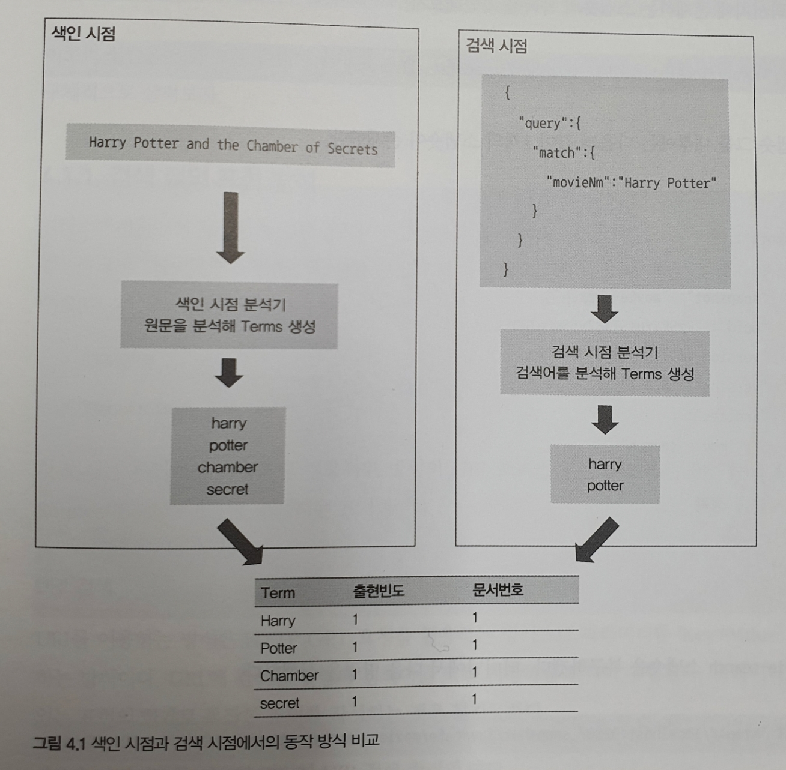

## 4.1 검색 API
문장은 색인시점에 텀으로 분해된다. 검색 시에는 이 텀을 이치시켜야 검색이 가능해진다.  
다음은 색인시점과 검색시점의 기본적인 동작과정을 표현한 것이다.

엘라스틱서치는 색인 시점에 Analyzer를 통해 분석된 텀을 term, 출현빈도, 문서번호와 같이 역색인 구조로 만들어 내부적으로 저장한다.  
검색 시점에는 Keyword 타입과 같은 분석이 불가능한 데이터와 Text 타입과 같은 분석이 가능한 데이터를 구분해서 분석이 가능할 경우 분석기를 이용해 분석한다.  
검색시점에도 텀을 얻을 수 있으며, 해당 텀으로 역색인 구조를 이용해 문서를 찾고 스코어를 계산해서 결과로 제공한다.  
실습에 앞서 movie_search 인덱스를 복구한다.  
먼저 엘라스틱서치에 존재하는 스냅숏 목록을 확인해본다.
~~~
GET /_snapshot/javacafe/_all?pretty
~~~
결과 javacafe 스냅숏 그룹 내부에는 1개의 스냅숏이 존재한다.
~~~
{
  "snapshots": [
    {
      "snapshot": "movie-search",
      "uuid": "Kz5k4fusS7KBZy55wLeZ0Q",
      "repository": "javacafe",
      "version_id": 6040399,
      "version": "6.4.3",
      "indices": [
        "movie_search"
      ],
      (... 생략 ...)
    }
  ],
  "total": 1,
  "remaining": 0
}
~~~
moive-search 스냅숏을 복구한다.
~~~
POST /_snapshot/javacafe/movie-search/_restore
~~~
인덱스가 잘 생성됐는지 확인해본다.
정상적으로 생성됐다면 movie_search 인덱스에 총 63069건의 데이터가 존재한다.
~~~
GET /_cat/indices/movie_search?v&pretty

health status index        uuid                   pri rep docs.count docs.deleted store.size pri.store.size
yellow open   movie_search 8uAu9cFwTyuyCGyFqt2ecA   5   1      63069            0     14.6mb         14.6mb

~~~

### 4.1.1 검색 질의 표현 방식
엘라스틱서치에서 제공하는 검색 API는 기본적으로 질의(Query)를 기반으로 동작한다.  
검색 질의에는 검색하고자 하는 조건들을 명시할 수 있으며 동일한 조건을 다음과 같은 두가지 방법으로 표현할 수 있다.
~~~
- URI 검색
- Request Body 검색
~~~
첫 번쨰는 루씬에서 사용하던 전통적인 방식의 URI 표기법이고  
두 번째는 RESTful API를 이용해 RequestBody에 조건을 표기하는 방법이다.

- URI 검색  
HTTP GET 요청을 활용하는 방식으로 파라미터를 "Key=Value" 형태로 전달 하는 방식이다.  
URL에 검색할 칼럼과 검색어를 직접 지정하면 검색이 수행된다.
~~~
GET movie_search/_search?q=prdtYear:2018
~~~

- RequestBody 검색  
HTTP 요청시 Body에 검색할 칼럼과 검색어를 JSON 형태로 표현해서 전달하는 방식이다.  
JSON 형태의 표현을 좀 더 효율적으로 하기 위해 엘라스틱서치에서는 Query DSL이라는 특별한 문법을 지원한다.  
이를 이용하면 URI 방식에 비해 다양한 조합의 검색 쿼리를 작성할 수 있다.  
엘라스틱서치가 제공하는 검색 API를 모두 활용하기 위해서는 반드시 Request Body 방식을 이용해야 한다.
위의 URI로 표현한 질의를 RequestBody 방식으로 변경한 쿼리다.
~~~
POST /movie_search/_search
{
  "query": {
    "term": {
      "prdtYear": "2018"
    }
  }
}
~~~

### 4.1.2 URI 검색
URI 검색은 단순하고 사용하기 편리하지만 복잡한 질의문을 입력하기 힘들다는 치명적인 단점이 있다.  
또한 URI 검색을 이용할 경우에는 엘라스틱서치에서 제공하는 모든 검색 옵션을 사용할 수 없다.  
하지만 장점도 있는데 웹브라우저를 이용해 빠르게 테스트 할 수 있다는 점이다.

URI 검색에서 자주 사용하는 파라미터

|       파라미터       |            기본값             |                         설명                         |
|:----------------:|:--------------------------:|:--------------------------------------------------:|
|        q         |             -              |              검색을 수행할 쿼리 문자열 조건을 지정한다.              |
|        df        |             -              | 쿼리에 검색을 수행할 필드가지정되지 않았을 경우 기본값으로 검색할 필드를 지정한다. |
|     analyzer     | 검색 대상 필드에 설정된  형태소 분석기 |        쿼리 문자열을형태소 분석할 때 사용할 형태소 분석기를 지정한다.         |
| analyze_wildcard |           false            |           접두어/와일드카드(*) 검색 활성화 여부를 지정한다.            |
| default_operator |             OR             |   두 개 이상의 검색 조건이 쿼리 문자열에 포함된 경우 검색 조건 연산자를 설정한다.   |
|     _source      |            true            |             검색 결과에 문서 본문 포함 여부를 지정한다.              |
|       sort       |             -              |               검색 결과의 정렬 기준 필드를 지정한다.               |
|       from       |             -              |               검색을 시작할 문서의 위치를 설정한다.                |
|       size       |             -              |                반환할 검색 결과 개수를 설정한다.                 |

q 옵션에는 기본적으로 '[필드명]:검색어' 형태로 입력할 수 있으며, 예제와 같이 여러 개의 필드를 검색할 때는 공백을 입력한 후 추가적인 필드명과 검색어를 입력한다.  
URI 검색에 q옵션에 사용되는 검색 문자열은 사실 Request Body 검색에서 제공되는 Query String Search 옵션과 동일하게 동작한다.  
다양한 필드를 검색조건으로 추가해서 검색을 요청했다.
~~~
POST movie_search/_search?q=movieNmEn:* AND prdtYear:2017&analyze_wildcard=true&from=0&size=5&sort=
_source:desc,movieCd:asc&_source_includes=movieCd,movieNm,movieNmEn,typeNm
~~~
검색조건은 다음과 같다
~~~
1. movieNmEn:* AND prdtYear:2017 -- 필드에 대한 쿼리 조건
2. analyze_wildcard=true -- 와일드카드 옵션 활성화
3. from=0 -- 페이징을 위한 시작값 설정
4. size=5 -- 페이징을 위한 사이즈 설정
5. sort=_source:desc,movieCd:asc -- 결과 정렬
6. _source_includes=movieCd,movieNm,movieNmEn,typeNm -- 포함할 _source 필드명
~~~
URI 검색은 검색 조건을 몇가지만 추가해도 검색식이 너무 복잡해져서 사용하기가 불편하고 가독성도 무척 떨어진다.  
그러므로 URI 검색은 별도의 검색을 확인할 도구가 없다거나 간단한 조회가 필요할 경우에만 사용하고 가능한 한 Request Body 방식의 검색을 사용하자.  

### 4.1.3  Request Body 검색
Request Body 검색은 질의 내용을 JSON 형태로 작성하며, 이때 Query DSL이라 불리는 DSL(도메인 전용 언어) 문법을 사용한다.  
URI 검색에서 사용된 복잡한 검색 옵션이 Request Body 검색으로 변경한 것이다.
~~~
POST /movie_search/_search
{
  "query": {
    "query_string": {
      "query": "movieNmEn:* OR prdtYear:2017",
      "default_field": "movieNmEn"
    }
  },
  "from": 0,
  "size": 5,
  "sort": [
      {
      "_score": {
        "order": "desc"
      },
      "movieCd": {
        "order": "asc"
      }
    }
  ],
  "_source": {
    "includes": [
      "movieCd",
      "movieNm",
      "movieNmEn",
      "typeNm"
    ]
  }
}
~~~
JSON 구조를 파악하고 살펴보면 상대적으로 가독성이 좋아진 것을 느낄 수 있다. 즉 Query DSL을 사용하면 복잡한 검색 옵션도 깔끔한 JSON 구조로 표현하는 것이 가능하다.  

## 4.2 Query DSL 이해하기

### 4.2.1 Query DSL 쿼리의 구조
~~~
{
 1. "size":
 2. "from": 
 3. "timeout": 
 4. "_source": { }
 5. "query": { }
 6. "aggs": { }
 7. "sort": { }
}
~~~
1. 리턴받는 결과의 개수를 지정한다. 기본값은 10이다.
2. 몇 번째 문서부터 가져올지 지정한다. 기본값은 0이며, 페이지별로 구성하려면 다음 번 문서는 10번째부터 가지고 오면 된다.
3. 검색을 요청해서 결과를 받는 데까지 걸리는 시간을 나타낸다. timeout 시간을 너무 짧게 잡으면 전체 샤드에서 timeout을 넘기지 않은 문서만 결과로 출력되기 떄문에
상황에 따라 결과의 일부만 나올 수 있다. 기본값은 무한대다.
4. 검색시 필요한 필드만 출력하고 싶을때 사용한다.
5. 검색조건문이 들어가야 하는 공간이다.
6. 통계 및 집계 데이터를 사용할 때 사용하는 공간이다.
7. 문서 결과를 어떻게 출려할지에 대한 조건을 사용하는 공간이다.
~~~
{
 1. "took":
  
 2. "timed_out":
  
  "_shards": {
 3.   "total": 
 4.   "successful":
 5.   "failed": 
  },
  
  "hits": {
  6.  "total":
  7.  "max_scroe":
  8.  "hits": [ ]
}
~~~
1. 쿼리를 실행한 시간을 나타낸다.
2. 쿼리 시간이 초과할 경우를 나타낸다.
3. 쿼리를 요청한 전체 샤드의 개수를 나타낸다.
4. 검색 요청에 성공적으로 응답한 샤드의 개수를 나타낸다.
5. 검색 요청에 실패한 샤드의 개수를 나타낸다.
6. 검색어에 매칭된 문서의 전체 개수를 나타낸다.
7. 일치하는 문서의 스코어 값 중 가장 높은 값을 출력한다.
8. 각 문서 정보와 스코어 값을 보여준다.

### 4.2.2 Query DSL 쿼리와 필터
Qeury DSL을 이용해 검색 질의를 작성할 때 조금만 조건이 복잡해지더라도 여러 개의 작은 질의를 조합해서 사용해야 한다.  
이때 작성되는 작은 질의들을 두 가지 형태로 나눠서 생각해볼 수 있다.  
실제 분석기에 의한 전문 분석이 필요한 경우와 단순히 'YES/NO'로 판단할 수 있는 조건 검색의 경우다.  
전자를 쿼리(Queries) 컨텍스트라 하고, 후자를 필터(Filter) 컨텍스트라는 용어로 구분하고 있다.

|  -   |                                   쿼리 컨텍스트                                   |                                   필터 컨텍스트                                   |
|:----:|:---------------------------------------------------------------------------:|:---------------------------------------------------------------------------:|
|  용도  |                                 전문 검색 시 사용                                  |                            조건 검색 시 사용(예: YES/NO)                            |
|  특징  | 분석기에 의해 분석이 수행됨. 연관성 관련 Score를 계산. 루씬 레벨에서 분석 과정을 거쳐야 하므로 상대적으로 느림. | Yes/No로 단순 판별 가능. 연관성 관련 계산을 하지 않음. 엘라스틱서치 레벨에서 처리가 가능하므로 상대적으로 빠름. |
| 사용 예 |                           "Harry Potter" 같은 문장 분석                           |      "create_year" 필드의 값이 2018년인지 여부 "status" 필드에 'use'라는 코드 포함 여부      |

대부분의 경우 쿼리 방식과 필터 방식 중 어떤 방식로 검색 질의를 표현하더라도 같은 결과를 얻을 수 있다.  
하지만 어떤 질의 방식을 사용하느냐에 따라 엘라스틱서치 내부의 검색 과정이나 성능이 크게 달라지기 때문에 가능한 한 용도에 맞게 사용해야 한다.

- 쿼리 컨텍스트
  - 문서가 쿼리와 얼마나 유사한지를 스코어로 계산한다.
  - 질의가 요청될 때마다 엘라스틱서치에서 내부의 루씬을 이용해 계산을 수행한다(이때 결과가 캐싱되지 않는다.)
  - 일반적으로 전문 검색에 많이 사용한다.
  - 캐싱되지 않고 디스크 연산을 수행하기 때문에 상대적으로 느리다.

다음 예제에서는 '기묘한 가족'이라는 문장을 대상으로 형태소 분석을 수행해서 movieNm 필드를 검색한다. 이때 검색 결과를 얻기 위해 모든 문서의 movieNm 필드 데이터를 분석하는 과정을 거친다.
~~~
POST /movie_search/_search
{
  "query": {
    "match": {
      "movieNm": "기묘한 가족"
    }
  }
}
~~~

- 필터 컨텍스트
  - 쿼리의 조건과 문서가 일치하는지 (Yes/No)를 구분한다.
  - 별도로 스코어를 계산하지 않고 단순 매칭 여부를 검사한다.
  - 자주 사용되는 필터의 결과는 엘라스틱서치가 내부적으로 캐싱한다.
  - 기본적으로 메모리 연산을 수행하기 때문에 상대적으로 빠르다.

다음 예제에서는 전체 문서 중 repGenreNm 필드의 값이 '다큐멘터리'인 문서만 필터링해서 검색한다.  
검색하기 전에 필터링 과정을 미리 거치게 되며 검색 대상 문서의 수가 줄어들기 때문에 빠르게 결과를 얻을수 있다.
~~~
POST /movie_search/_search
{
  "query": {
    "bool": {
      "must": [
        {
          "match_all": {
          }
        }
      ],
      "filter": {
        "term": {
          "repGenreNm": {
            "value": "다큐멘터리"
          }
        }
      }
    }
  }
}
~~~

### 4.2.3 Query DSL의 주요 파라미터

- Multi Index 검색  
기본적으로 모든 검색 요청은 Multi Index 및 Multi Type 검색이 가능하다.  
이러한 특성 때문에 다수의 인덱스를 검색해야 할 때도 한 번의 요청으로 검색 결과를 얻을 수 있다. 검색요청 시 ","를 이용해 다수의 인덱스명을 입력할 수 있다.  
이때 지정된 모든 인덱스가 검색 대상이 된다.

다음은 repGenrenm이라는 필드에 "다큐멘터리"라는 검색어를 지정해서 검색한 예다.  
MultiIndex 기능을 이용했기 때문에 검색 시 movie_search 인덱스와 movie_auto 인덱스를 모두 검색한다.
~~~
POST movie_search,movie_auto/_search
{
  "query": {
    "term": {
      "regGenreNm": {
        "value": "다큐멘터리"
      }
    }
  }
}
~~~

movie_search 인덱스와 movie_auto 인덱스는 모두 repGenreNm 필드를 공통적으로 가지고는 있지만 서로 다른 스키마 구조를 가지고 있다.  
하지만 MultiIndex 쿼리를 이용하면 다수의 비정형 데이터를 가지고 있는 경우에도 한번에 검색할 수 있다.

검색 요청 시 인덱스 이름을 지정할 때 "*"를 와일드카드로 사용할 수 있다. 예를 들어, 특정 로그가 날짜 별로 생성된다고 가정해보자.  
이때 생성되는 인덱스명이 "log-2019-01-01" 형태라면 비교적 손쉽게 Multi Index 검색이 가능해진다.  
예를 들어, 2019년에 생성된 모든 인덱스의 데이터를 검색하고 싶다면 다음과 같이 작성한다.
~~~
POST /log-2019-*/_search
~~~
이러한 Multi Index 검색 기능 덕분에 엘라스틱서치는 매우 강력한 검색 기능을 제공할 수 있다.  
또한 이를 바탕으로 집계 API와 접목해서 대량의 데이터를 효율적으로 집계하고 통계를 제공하는 것이 가능해졌다.

- 쿼리 결과 페이징  
페이징을 구현하기 위해서는 문서의 시작을 나타내기위해 from 파라미터를, 문서의 개수를 나타내기 위해 size 파라미터를 사용하면 된다.  
이 때 기본값으로 from은 0, size는 5로 설정돼 있으며, 2페이지로 이동할경우 from은 5, size는 5로 지정하면 된다.

다음은 첫번째 페이지를 요청하는 예다. 기본값이기 때문에 생략하는 것도 가능하다.
~~~
# 첫 번째 페이지 요청
POST /movie_search/_search
{
  "from": 0,
  "size": 5,
  "query": {
    "term": {
      "repNationNm": {
        "value": "한국"
      }
    }
  }
}
~~~
~~~
# 두 번째 페이지 요청
POST /movie_search/_search
{
  "from": 5,
  "size": 5,
  "query": {
    "term": {
      "repNationNm": {
        "value": "한국"
      }
    }
  }
}
~~~
엘라스틱서치는 관계형 데이터베이스와 다르게 페이징된 해당 문서만 선택적으로 가져오는 것이 아니라 모든 데이터를 읽게 된다.  
예를 들어, 예제와 같이 5건씩 페이징한 검색 결과의 2페이지를 요청하더라도 총 10건의 문서를 읽어야만 한다.  
설정된 페이지를 제공하기 위해서는 전체를 읽어서 사이즈만큼 필터링해서 제공하는 구조이기 때문에 페이지 번호가 높아질수록 쿼리 비용은 덩달아 높아질 수박에 없다는 점에 주의해야 한다.  

- 쿼리 결과 정렬  
엘라스틱서치가 기본적으로 계산한 유사도에 의한 스코어 값으로 정렬하는 것이 아니라 필드의 이름이나 가격, 날짜 등을 기준으로 재졍렬하고 싶은 경우가 있다.  
- 이럴때 사용하는 것이 sort 파라미터다.
~~~
POST /movie_search/_search
{
  "query": {
    "term": {
      "repNationNm": {
        "value": "한국"
      }
    }
  },
  "sort": {
    "prdtYear": {
      "order": "asc"
    }
  }
}
~~~
정렬을 위한 옵션으로 각각 오름차순과 내림차순을 나타내는 asc과 desc을 제공한다. 이를 이용해 오름차순이나 내림차순으로 정렬을 수행하면 된다. 

결과 중 스코어 값이 같은 경우에는 두 번째 정렬을 사용해 문서의 순위를 변경할 수 도 있다.  
다음 예제에서는 추가 정렬 기준으로 _score 값을 사용했다.
~~~
POST /movie_search/_search
{
  "query": {
    "term": {
      "repNationNm": {
        "value": "한국"
      }
    }
  },
  "sort": {
    "prdtYear": {
      "order": "asc"
    }
  }
}
~~~

- _source 필드 필터링  
검색 결과는 기본적으로 JSON 데이터로 제공된다. 이때 실제 데이터는 _source 항목 아래에 존재하며 문서 내부에 존재하는 각 필드가 모두 결과로 제공된다.  

다음 검색 결과에서 문서의 내용이 _source 항목으로 제공되는 것을 확인할 수 있다.
~~~
{
"hits": {
    "total": {
      "value": 10000,
      "relation": "gte"
    },
    "max_score": null,
    "hits": [
      {
        "_index": "movie_search",
        "_type": "_doc",
        "_id": "6D3JqmkBjjM-ebDb9CXG",
        "_score": 1.2820898,
        "_source": {
          "movieCd": "20163446",
          "movieNm": "요리사",
          "movieNmEn": "The Cook",
          "prdtYear": "1918",
          "openDt": "",
          "typeNm": "단편",
          "prdtStatNm": "기타",
          "nationAlt": "한국",
          "genreAlt": "",
          "repNationNm": "한국",
          "repGenreNm": "",
          "directors": [],
          "companys": []
        },
        "sort": [
          1918,
          1.2820898
        ]
      }
    ]
}
~~~
하지만 항상 모든 필드를 볼 필요는 없으며, 필요에 따라 특정 필드를 검색 결과에서 제거하고 싶을 때도 있을 것이다.  
게다가 검색 결과에서 특정 칼럼을 제외하면 네트워크 사용량을 줄여 응답 속도도 빠르게 할 수 있다.  
이때 사용할 수 있는 옵션이 _source 필드를 필터링하는 옵션으로, 검색 요청 시 _source에 검색 결과에 포함하고 싶은 필드를 지정한다.  

다음 예제에서 검색 결과로 movieNm 필드만 필터링 되도록 한다.
~~~
POST /movie_search/_search
{
  "_source": [
    "movieNm"
  ],
  "query": {
    "term": {
      "repGenreNm": "한국"
    }
  }
}
~~~

- 범위 검색  
범위(Range)를 기반으로 한 쿼리를 살펴보자. 숫자나 날짜 데이터의 경우 지정한 값이 아닌 범위를 기준으로 질의해야 하는 경우가 있다.  
이를 위해 범위 검색을 할 수 있는 파라미터를 제공한다.

| 문법  | 연산자 |       설명       |
|:---:|:---:|:--------------:|
| lt  |  <  |   피연산자보다 작음    |
| gt  |  >  |    피연산자보다 큼    |
| lte | <=  | 피연산자보다 작거나 같다  |
| gte | >=  | 피연산자보다 크거나 같다. |

다음은 2016년부터 2017년 까지의 데이터를 조회하는 예다.
~~~
POST /movie_search/_search
{
  "query": {
    "range": {
      "prdtYear": {
        "gte": "2016",
        "lte": "2017"
      }
    }
  }
}
~~~

- operator 설정  
엘라스틱서치는 검색 시 문장이 들어올 경우 기본적으로 OR 연산으로 동작한다.  
하지만 실무에서는 OR 연산보다는 AND 연산을 사용해 정확도를 높여 검색해야 할 때가 많을 것이다.  
OR 연산이나 AND 연산을 어떻게 선택적으로 사용하는지 알아본다.

Query DSL 에서는 operator 파라미터를 통해 연산자를 명시적으로 지정하는 것이 가능하다.  
이를 이용해 명시적으로 "and"나 "or" 연산자를 명시적으로 지정할 수 있다. operator 파라미터가 생략된 경우에는 기본적으로 텀과 텀에 OR 연산자를 적용한다.
~~~
POST /movie_search/_search
{
  "query": {
    "match": {
      "movieNm": {
        "query": "자전차왕 엄복동",
        "operator": "AND"
      }
    }
  }
}
~~~
operator 파라미터를 생략하면 OR 연산으로 동작해서 "자전차왕" 혹은 "엄복동" 이라는 단어가 들어있는 모든 문서가 검색될 것이다.  
하지만 예제에서는 operator 파라미터를 이용해 "AND" 값을 명시했으므로 두 개의 텀이 모두 존재하는 문서만 결과로 제공한다.

- minimum_should_match 설정  
OR 연산을 사용할때 사용할수 있는 옵션이다. 일반적으로 OR 연산을 수행할 경우 검색 결과가 너무 많아질 수 있다.  
- 이 경우 텀의 개수가 몇 개 이상 매칭될 때만 검색 결과로 나오게 할 수 있는데 이때 사용 하는 파라미터가 minimum_should_match 이다.
~~~
POST /movie_search/_search
{
  "query": {
    "match": {
      "movieNm": {
        "query": "자전차왕 엄복동",
        "minimum_should_match": "2"
      }
    }
  }
}
~~~
위와 같이 작성한다면 텀의 개수와 minimum_should_match의 개수가 일치하기 때문에 AND 연산과 동일한 효과를 낼 수 있다.

- fuzziness 설정  
fuzziness 파라미터를 사용하면 단순히 같은 값을 찾는 Match Query를 유사한 값을 찾는 Fuzzy Query